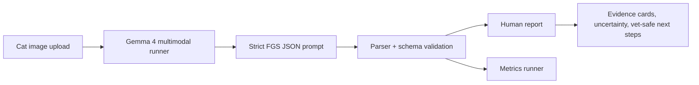

# Cat Pain Detector — Explainable Gemma 4 Triage Support for Hidden Feline Pain

Cats often hide pain until it is severe. Owners may notice only vague changes — hiding, eating less, becoming unusually quiet — and shelters or foster homes may not have immediate veterinary access. Cat Pain Detector is a Gemma 4 multimodal prototype that helps a human look more carefully at a cat face image using the Feline Grimace Scale (FGS): ear position, orbital tightening, muzzle tension, whisker change, and head position.

This is **triage support, not veterinary diagnosis**. The goal is to explain visible cues, uncertainty, and safe next steps so a person can decide when to monitor closely or contact a veterinarian.

## Architecture

The app uses a stable runner abstraction:

- `MockFGSRunner` for UI development.
- `Gemma4TransformersRunner` for Kaggle/server/local Python inference using `google/gemma-4/transformers/gemma-4-e2b-it`.
- `HTTPGemmaRunner` for a GPU-backed endpoint.

Gemma 4 receives the image plus a structured prompt. It must return one JSON object with five FGS action-unit scores, evidence, visibility flags, uncertainty, a normalized total score, rescue-threshold status, recommendation, and disclaimer. Thinking is disabled by default for this strict JSON task because early runs spent the token budget on hidden/visible reasoning instead of returning parseable JSON.

## Data and Validation Method

The project is validation-first. CatFLW is downloaded locally under CC BY-NC 4.0 and used only for demo images and future face/landmark validation; it does not contain pain labels. Three official FGS educational examples are stored locally as reference-only smoke/calibration data. They are not a clinical validation set.

The real target validation protocol is ready for FGS-labeled clinical images: total normalized FGS MAE/RMSE, rescue-threshold accuracy/precision/recall/specificity/F1, confusion matrix, per-action-unit accuracy/MAE, coverage, and uncertainty slices. Dataset request emails are drafted for the 2019 FGS validation study, the 2023 automated FGS prediction study, and the 2024 video pain-recognition study.

## Current Measured Results

On the tiny official FGS educational smoke set, Gemma 4 parsed all 3/3 outputs, but under-called pain:

- Normalized FGS MAE: 0.50
- Rescue-threshold accuracy: 0.333
- Recall/sensitivity: 0.0
- Confusion matrix: TN=1, FP=0, FN=2, TP=0
- Per-action-unit accuracy: 0.333 for all five cues

A prompt calibration iteration added guardrails against all-zero under-calling, but the measured smoke metric did not improve. This is important: the demo is working, but the model is not yet reliable enough for accuracy claims.

## Demo Experience

The Gradio demo lets a user upload a cat image or pick a licensed CatFLW sample. The report shows:

- a clear recommendation badge,
- FGS total and threshold status when all cues are visible,
- evidence cards for each facial cue,
- uncertainty display,
- vet-safe next steps and safety disclaimer,
- raw structured JSON for auditability.

## Limitations and Safety

This prototype must not be used to delay veterinary care. It can miss pain indicators, especially with subtle facial cues, poor pose, sleeping/grooming, occlusion, or non-frontal images. Current smoke metrics are from only three educational examples and are not publishable clinical validation. The next technical milestone is to obtain FGS-labeled images, re-run the baseline, and improve with real in-context examples, landmark/crop preprocessing, or licensed fine-tuning.

## Impact

Even with limitations, the project demonstrates a responsible pattern for AI in pet health: use a validated clinical language, expose evidence and uncertainty, measure before claiming accuracy, and always point the human toward veterinary care when risk is present.
